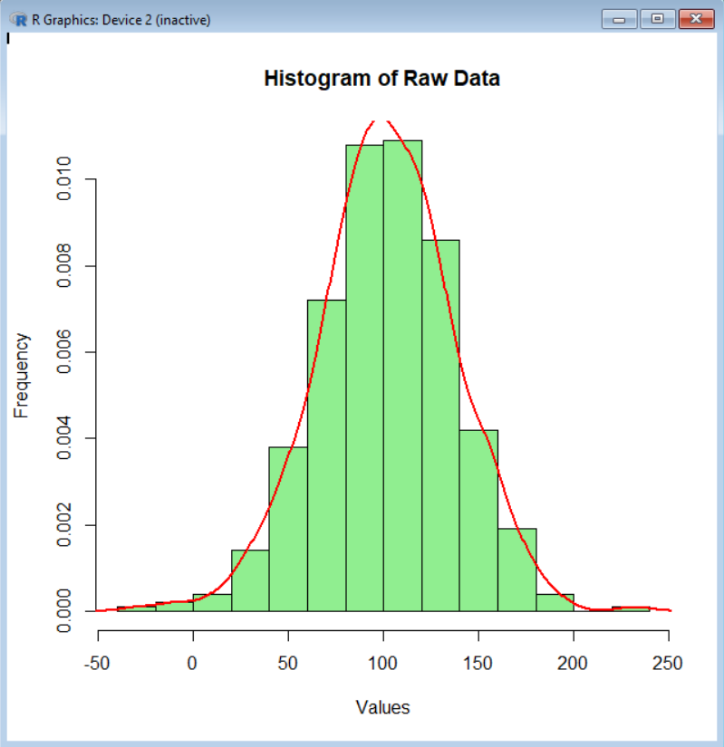
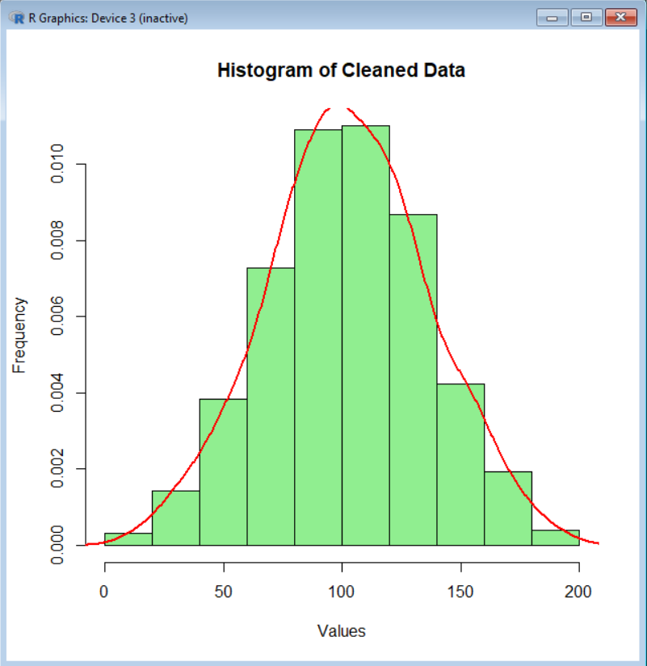
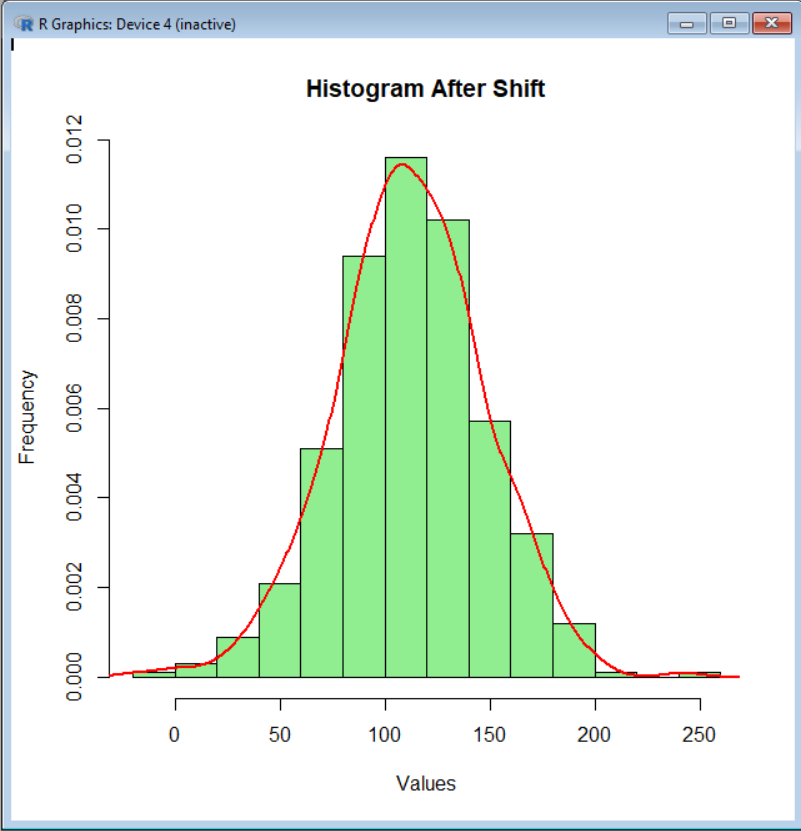
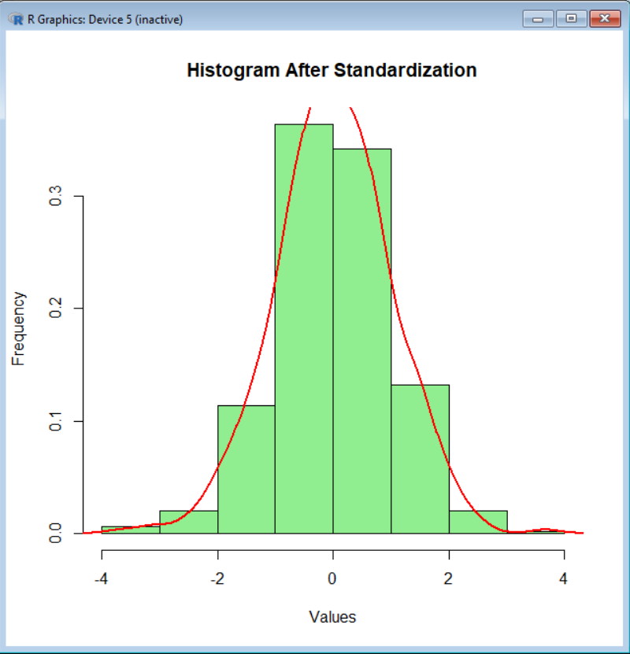

# Statistical Analysis Toolkit in R

This project implements a set of tools for exploratory data analysis (EDA) in R, including descriptive statistics, confidence intervals, hypothesis testing, outlier detection, data transformations, and visualization.

---

## Overview

The goal of this project is to analyze numerical datasets and demonstrate a complete statistical workflow:

- descriptive statistics
- confidence intervals
- hypothesis testing
- outlier detection and removal
- data transformations
- visualization of distributions

---

## Features

- Calculation of key statistics:
  - mean, median, mode
  - variance, standard deviation

- Confidence intervals:
  - for mean (t-distribution)
  - for variance (chi-square distribution)

- Hypothesis testing:
  - Student’s t-test
  - Mann–Whitney U test

- Outlier detection:
  - IQR method
  - Z-score method

- Data transformations:
  - shift transformation
  - standardization
  - logarithmic transformation

- Visualization:
  - histograms with density curve
  - empirical distribution function (ECDF)

---

## Example Results

The project was tested on two datasets (`norm.txt` and `norm1.txt`), each containing 500 values.

### Descriptive statistics (dataset 1)

- Mean: 101.81
- Median: 101.34
- Mode: 107.75
- Variance: 1261.51
- Standard deviation: 35.52

### Confidence intervals

- Mean: [98.69, 104.93]
- Variance: [1118.53, 1433.94]

### Hypothesis testing

- Student’s t-test p-value: 1.23e-233
- Mann–Whitney test p-value: 4.67e-161

This indicates a statistically significant difference between the two datasets.

### Outliers detected

Examples of detected outliers:

- -8.81
- -9.05
- 232.01
- 8.61
- -28.10

---

## Visualization

### Raw Data Distribution

### Cleaned Data (without outliers)

### After Shift Transformation

### After Standardization

---

## How to Run

1. Open the script in RStudio
2. Run the code using `Source` or `Ctrl + Shift + Enter`
3. Select input files when prompted:
   - first dataset: `norm.txt`
   - second dataset: `norm1.txt`

---

## Project Structure

statistical-analysis-r/
├── analysis.R
├── norm.txt
├── norm1.txt
└── screenshots/

---

## What This Project Demonstrates

- practical statistical analysis in R
- hypothesis testing
- data preprocessing and cleaning
- visualization of distributions
- understanding of real-world data behavior

---

## 🇺🇦 Опис українською

Цей проєкт реалізує набір функцій для первинного статистичного аналізу даних у R.

Реалізовано:

- обчислення основних статистичних характеристик
- побудову довірчих інтервалів
- перевірку гіпотез за допомогою t-тесту Стьюдента та тесту Манна–Уітні
- виявлення та видалення аномальних значень
- перетворення даних (зсув, стандартизація, логарифмування)
- побудову гістограм та емпіричної функції розподілу

Проєкт демонструє практичні навички статистичного аналізу, очищення даних та візуалізації результатів у середовищі R.
